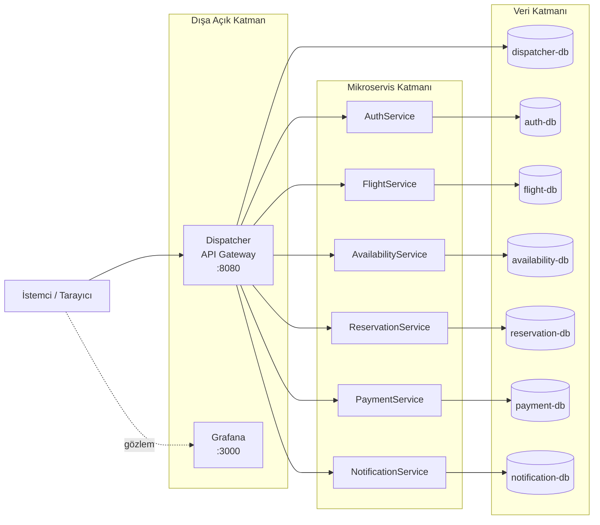
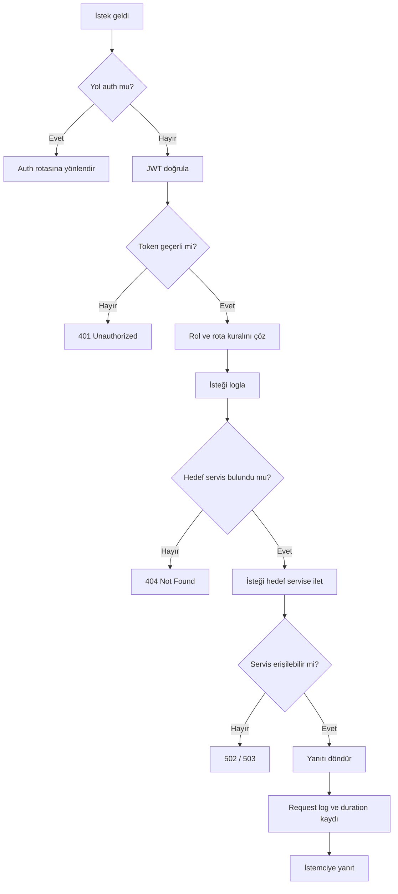
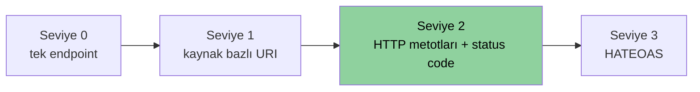
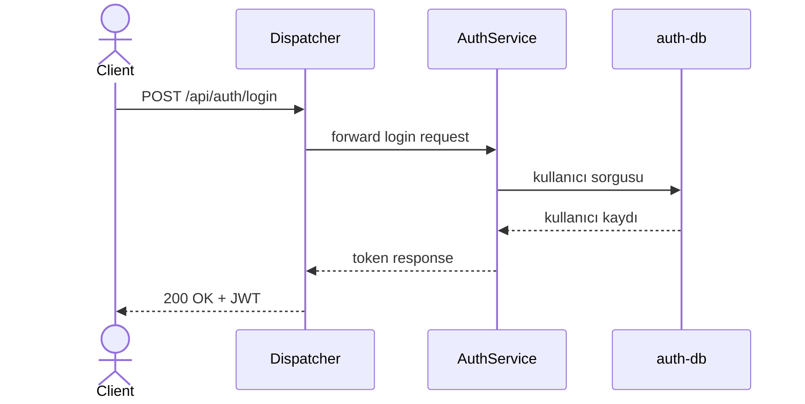
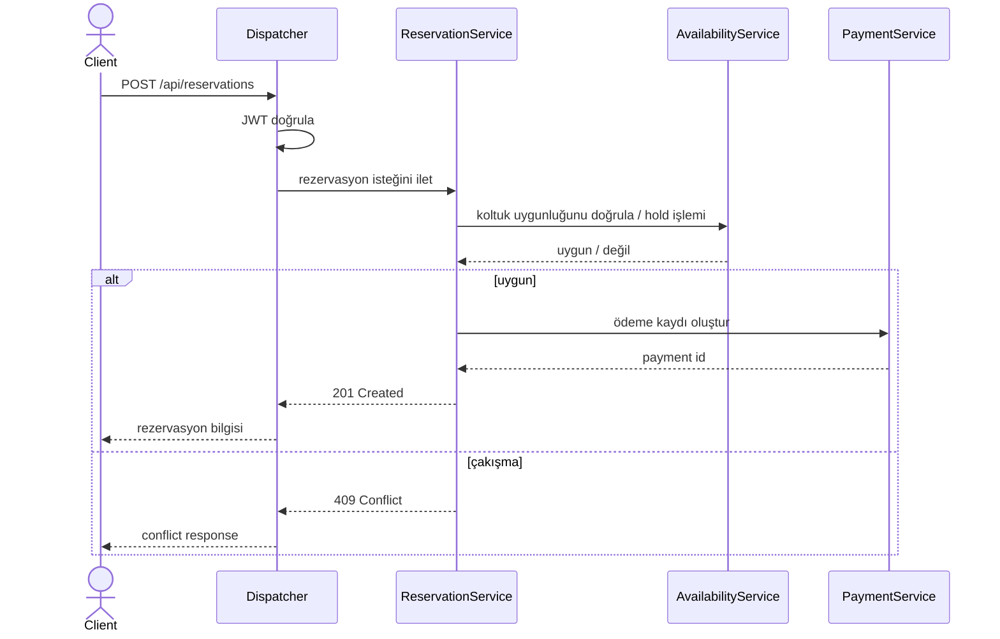
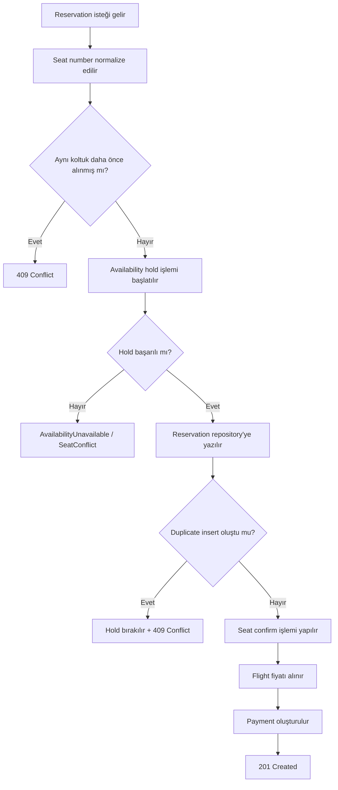
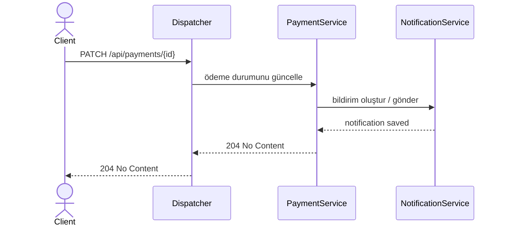
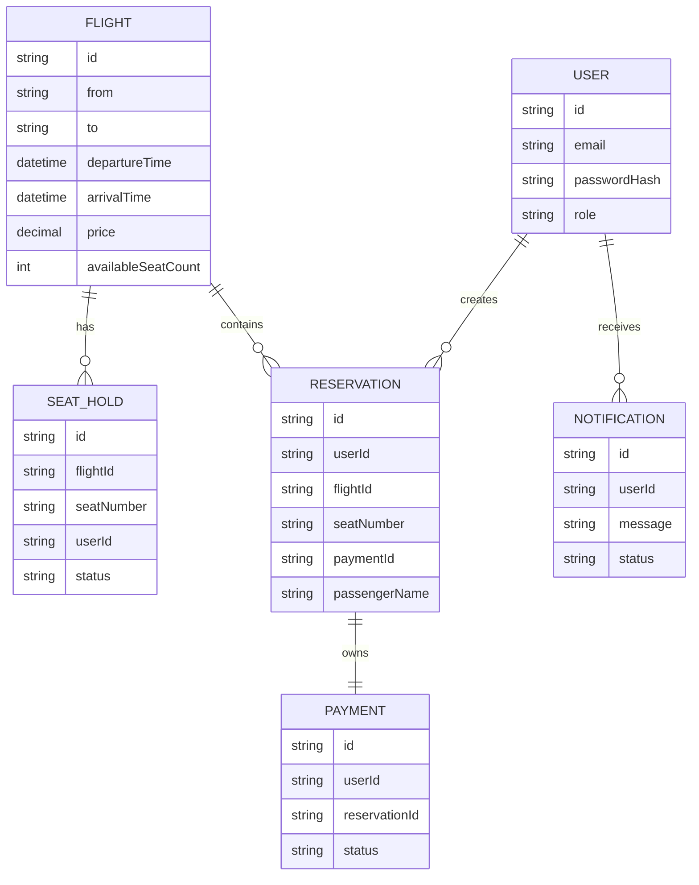

# Yazılım Geliştirme Laboratuvarı-II · Proje 1


| Alan | Bilgi |
|---|---|
| Proje Adı | Flight Reservation Microservices |
| Geliştirici Ekip | Esma Nur Mantı - Nalan Kara |
| Tarih | 05.04.2026 |

---

## 1. Giriş ve Amaç

### Problemin Tanımı

Dağıtık yapılarda her servisin ayrı ayrı kimlik doğrulama, loglama, yönlendirme ve hata yönetimi üstlenmesi; bakım maliyetini artırır, güvenlik kurallarını parçalı hale getirir ve yük altında sistem davranışının izlenmesini zorlaştırır. Birden fazla servisin dış dünyaya açık olması da hem operasyonel karmaşıklık hem de saldırı yüzeyi oluşturur.

### Proje Amacı

Bu proje; tüm istemci trafiğini merkezi bir `Dispatcher` API Gateway üzerinden alan, mikroservisleri tek bir giriş noktasının arkasında toplayan, JWT tabanlı güvenliği merkezileştiren, servis bazlı MongoDB ayrımını koruyan ve web tabanlı dashboard ile gözlemlenebilirlik sağlayan bir uçuş rezervasyon sistemi geliştirmeyi amaçlar.

### Temel Hedefler

- Dispatcher üzerinden merkezi yönlendirme ve güvenlik
- En az 4 mikroservis içeren ölçeklenebilir bir mimari
- Her servis için ayrı NoSQL veritabanı yaklaşımı
- `docker compose up --build` ile tek komutta ayağa kalkan sistem
- TDD odaklı test altyapısı
- k6 ile profesyonel yük testi
- Grafana ve özel dashboard ile canlı trafik görselleştirmesi

### Teknoloji Yığını

| Bileşen | Teknoloji | Sürüm |
|---|---|---|
| Dispatcher | ASP.NET Core Web API | .NET 9 |
| Mikroservisler | ASP.NET Core Web API | .NET 9 |
| Ortak güvenlik | JWT Bearer Authentication | .NET ekosistemi |
| Veritabanı | MongoDB | 7.0 |
| Görselleştirme | Grafana | 11.2.0 |
| Yük Testi | k6 | script tabanlı |
| API Dokümantasyonu | Swagger / OpenAPI | Swashbuckle |
| Test | xUnit | .NET 9 uyumlu |

---

## 2. Sistem Tasarımı ve Mimari

### Genel Mimari



Bu yapı, sistemi üç net katmanda düşünmeyi kolaylaştırır:

- dış dünyaya açık giriş noktaları
- iş kurallarını barındıran mikroservisler
- servislerden izole veri katmanı

### Dispatcher Akışı



### Mimari Özeti

- `Dispatcher`, sistemin tek public giriş noktası olarak çalışır.
- Mikroservisler host makineye `ports` ile açılmaz; compose içinde `expose` kullanılır.
- Her servis kendi MongoDB instance'ına sahiptir.
- Reservation, Availability, Payment ve Notification servisleri arasında iş akışı vardır.
- Dispatcher hem request log tutar hem de dashboard üzerinden canlı trafik özeti sunar.

---

## 3. Richardson Olgunluk Modeli

Richardson Olgunluk Modeli, REST servislerinin URI tasarımı, HTTP metotları ve hypermedia kullanımı açısından olgunluk seviyesini tanımlar.



### Projede Uygulanan Seviye

Bu proje temelde **RMM Seviye 2** hedefini karşılar:

- Kaynak odaklı URI tasarımı vardır.
- `GET`, `POST`, `PUT`, `PATCH`, `DELETE` metotları anlamsal olarak kullanılır.
- Uygun `2xx`, `4xx` ve `5xx` durum kodları döndürülür.

### Örnek Rota ve Durum Kodları

| Kaynak | URI | HTTP Metodu | Başarı | Hata |
|---|---|---|---|---|
| Kayıt | `/api/auth/register` | POST | 200 | 400 |
| Giriş | `/api/auth/login` | POST | 200 | 401 |
| Profil | `/api/auth/me` | GET | 200 | 401, 404 |
| Uçuş listeleme | `/api/flights` | GET | 200 | 401, 403 |
| Uçuş oluşturma | `/api/flights` | POST | 201 | 400, 401, 403 |
| Uçuş güncelleme | `/api/flights/{id}` | PUT | 204 | 401, 403, 404 |
| Uçuş silme | `/api/flights/{id}` | DELETE | 204 | 401, 403, 404 |
| Koltuk durumu | `/api/availability/{flightId}` | GET | 200 | 401, 403 |
| Hold koyma | `/api/availability/{flightId}/seats/{seat}/hold` | PUT | 200 | 401, 403, 409 |
| Rezervasyon oluşturma | `/api/reservations` | POST | 201 | 400, 401, 404, 409, 503 |
| Ödeme güncelleme | `/api/payments/{id}` | PATCH | 204 | 400, 401, 403, 404 |

---

## 4. Servis Yapıları ve Sorumlulukları

### Katmanlı Organizasyon

Her servis benzer bir katmanlı yapı ile düzenlenmiştir:

- `*.Api`
- `*.Application`
- `*.Domain`
- `*.Infrastructure`
- `*.Tests`

Bu yapı:

- sorumluluk ayrımı,
- test edilebilirlik,
- değişikliklerin izole edilmesi,
- altyapı kodunun iş kurallarından ayrılması

için tercih edilmiştir.

### Dispatcher

Dispatcher katmanı şu teknik görevleri üstlenir:

- route çözme ve proxy işlemi
- JWT doğrulama
- rol tabanlı güvenlik
- request log kaydı
- dashboard ve log API sunumu
- canlı trafik için grafikler

### Mikroservislerin Ana Sorumlulukları

| Servis | Ana Sorumluluk |
|---|---|
| `AuthService` | kullanıcı kaydı, login, token ile kullanıcı bilgisi döndürme |
| `FlightService` | uçuş CRUD işlemleri |
| `AvailabilityService` | koltuk uygunluğu, hold ve rezervasyon durumu |
| `ReservationService` | rezervasyon oluşturma ve kullanıcı rezervasyonlarını listeleme |
| `PaymentService` | ödeme oluşturma ve durum güncelleme |
| `NotificationService` | bildirim oluşturma, gönderme ve okundu işaretleme |

---

## 5. Sequence Diyagramları

### 5.1 Kullanıcı Girişi



### 5.2 Rezervasyon Oluşturma



### Seat Conflict Akışı

Seat conflict akışı, sistemin en kritik yarış durumu senaryosunu temsil eder. Aynı koltuğa birden fazla isteğin eşzamanlı gelmesi halinde veri tutarlılığının korunması için hem `AvailabilityService` hem de `ReservationService` tarafında ek kontroller uygulanır.



Bu akışın temel amacı:

- aynı koltuğun iki farklı kullanıcıya satılmasını engellemek,
- hold başarısız olduğunda erken reddetmek,
- duplicate insert durumunda geri alma işlemi yaparak veri tutarlılığını korumaktır.

### 5.3 Ödeme Tamamlama ve Bildirim



---

## 6. Veri Katmanı Tasarımı

### Veritabanı Yaklaşımı

Her servis kendi verisini kendi MongoDB örneğinde tutar. Böylece servisler birbirlerinin veritabanına doğrudan bağımlı olmaz.

| Servis | Veritabanı |
|---|---|
| Dispatcher | `dispatcher-db` |
| AuthService | `auth-db` |
| FlightService | `flight-db` |
| AvailabilityService | `availability-db` |
| ReservationService | `reservation-db` |
| PaymentService | `payment-db` |
| NotificationService | `notification-db` |

### Mantıksal Veri İlişkileri



### Dispatcher Veri Kullanımı

Dispatcher servisinin MongoDB kullandığı iki ana alan vardır:

- route tanımlarının saklanması
- request log verilerinin tutulması

---

## 7. TDD ve Test Yaklaşımı

Proje boyunca TDD mantığına uygun olacak şekilde testlenebilir sınıf tasarımına öncelik verilmiştir. Dispatcher özelinde test önce, sonra implementasyon yaklaşımına dair commit kanıtları mevcuttur.

### Test Projeleri

| Proje | Test Dizini |
|---|---|
| Dispatcher | `gateway/Dispatcher/Dispatcher.Tests` |
| AuthService | `services/AuthService/AuthService.Tests` |
| FlightService | `services/FlightService/FlightService.Tests` |
| AvailabilityService | `services/AvailabilityService/AvailabilityService.Tests` |
| ReservationService | `services/ReservationService/ReservationService.Tests` |
| PaymentService | `services/PaymentService/PaymentService.Tests` |
| NotificationService | `services/NotificationService/NotificationService.Tests` |

### TDD Kanıtları


---

## 8. Test Senaryoları ve Kapsamı

### Dispatcher Testleri

Öne çıkan test başlıkları:

- `AuthorizationTests`
- `DatabaseRouteResolverTests`
- `DispatcherMetricsStoreTests`
- `ErrorHandlingTests`
- `ForwardingTests`
- `LoggingTests`
- `RequestLogsControllerTests`
- `EndToEndWorkflowTests`

### Mikroservis Testleri

Projede şu senaryolar test edilmiştir:

- başarılı login ve token üretimi
- yetkisiz erişimin reddedilmesi
- süresi dolmuş token'in reddedilmesi
- route çözümleme
- seat conflict
- reservation + payment + notification zinciri
- payment ownership kontrolü
- notification ownership kontrolü
- Mongo repository davranışları

### Sonuç Değerlendirmesi

Test mimarisi, projenin sadece controller düzeyinde değil; repository, application service ve entegrasyon davranışı seviyesinde de güvenceye alındığını gösterir.

---

## 9. Yük Testi Sonuçları

Yük testleri `monitoring/load-tests` altındaki k6 senaryoları ile gerçekleştirilmiştir. Sistemde ayrıca gerçekçi kullanım ağırlıkları içeren `dispatcher-realistic-workflow.js` senaryosu yer alır.

### Ölçülen Sonuçlar

`monitoring/load-tests/results-realistic.json` dosyasındaki güncel değerler:


### Sonuçların Yorumu

- Trafik arttıkça latency yükselmektedir; bu beklenen davranıştır.
- `results-realistic.json` notlarına göre sistem kaynaklı `5xx` oranı `%0` seviyesindedir.
- Görülen hata oranı büyük ölçüde iş kuralı çatışmaları ve koltuk rekabetinden kaynaklanan `409` benzeri durumları temsil eder.
- Sistem, 500 eşzamanlı kullanıcı altında dahi ana iş akışlarını sürdürebilmektedir.

---

## 10. Monitoring ve Gözlemlenebilirlik

Projenin güçlü yönlerinden biri Dispatcher üzerinde toplanan gözlemlenebilirlik katmanıdır.

### Sağlanan Bileşenler

- Grafana dashboard  
  

- Web tabanlı monitoring ekranı ve servis bazlı trafik dağılımı
  

- Detaylı log tablosu  
  

- Load test sonuçları API: 
  

### Dashboard Özellikleri

Dispatcher içindeki HTML tabanlı dashboard şu verileri gösterebilir:

- canlı trafik özet kartları
- toplam istek
- başarılı / başarısız istek sayısı
- ortalama duration
- hata oranı
- servis bazlı trafik dağılımı
- son request logları
- Grafana panel embed alanları
- yük testi özet kartları
- yük testi sonuç tablosu

---

## 11. Docker ve Sistem Orkestrasyonu

Tüm sistem tek komutla ayağa kalkar:

```powershell
docker-compose up --build
```

Compose dosyası şu bileşenleri orkestre eder:

- Dispatcher
- AuthService
- FlightService
- AvailabilityService
- ReservationService
- PaymentService
- NotificationService
- 7 ayrı MongoDB instance'ı
- Grafana

---

## 12. Ağ Yapısı ve İzolasyon

Sistem `backend` isimli Docker ağı üzerinde çalışır. Compose tanımına göre:

- Dispatcher dış dünyaya `8080` portu ile açılır.
- Grafana izleme amacıyla dışa açıktır.
- Mikroservisler `ports` ile publish edilmez; sadece `expose` edilir.
- Böylece servisler compose içi ağda görünür, host'tan doğrudan çağrılmaz.

### Değerlendirme

Projede tek backend network yaklaşımı kullanılmıştır. Ancak dış erişim kontrolü yine korunmuştur; çünkü uygulama servisleri host portu yayınlamaz.

---

## 13. Teknik Değerlendirme

### Güçlü Yönler

- 6 mikroservis + 1 merkezi gateway ile ders isterini fazlasıyla karşılar.
- Her servis için ayrı MongoDB kullanımı vardır.
- Güvenlik ve route yönetimi Dispatcher üzerinde merkezileştirilmiştir.
- Gözlemlenebilirlik yalnızca Grafana ile sınırlı değildir; özel dashboard da vardır.
- Reservation, Availability, Payment ve Notification arasında gerçek iş akışı kurulmuştur.
- Test altyapısı proje geneline yayılmıştır.

### Sınırlılıklar

- Tüm sistem tek compose dosyası içinde çalıştığı için ileri ölçekleme senaryoları ayrıca ele alınmamıştır.
- Distributed tracing yoktur.
- Rate limiting ve circuit breaker gibi ileri gateway özellikleri henüz eklenmemiştir.
- Log saklama stratejisi zamanla daha da zenginleştirilebilir.

### Geliştirme Fikirleri

- distributed tracing eklemek
- rate limiting eklemek
- circuit breaker ve retry politikaları eklemek
- event-driven mimari ile servisler arası coupling'i azaltmak
- yönetici / müşteri arayüzünü görsel olarak genişletmek

---

## 15. Kurulum ve Çalıştırma

### Gereksinimler

| Araç | Sürüm |
|---|---|
| Docker Desktop | güncel |
| Docker Compose | v2+ |
| .NET SDK | 9.0 |

### 1. Repoyu klonla

```bash
git clone https://github.com/nalankaraa/flight-reservation-microservices.git
cd flight-reservation-microservices
```

### 2. Sistemi başlat

```bash
docker compose up --build
```

Arka planda çalıştırmak için:

```bash
docker compose up --build -d
```

### 3. Swagger portlarını da açmak istersen

```bash
docker compose -f docker-compose.yml -f docker-compose.swagger.yml up --build
```

### 4. Servisleri doğrula

```bash
docker compose ps
```

### 5. Varsayılan yönetici hesabı

```text
E-posta: admin@system.local
Şifre:   Admin123!
```

### 6. Sistemi durdur

```bash
docker compose down
```

Volume'ları da silmek istersen:

```bash
docker compose down -v
```
